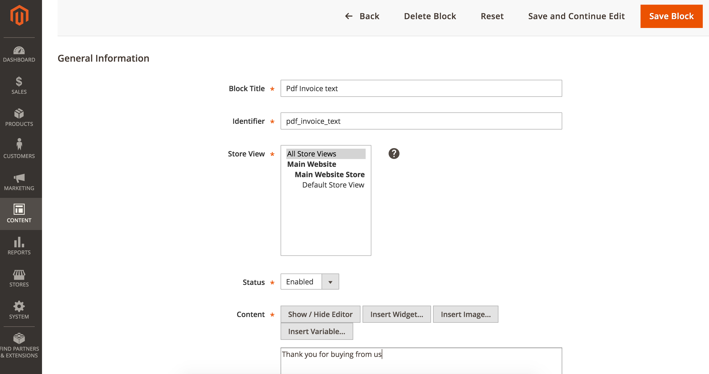
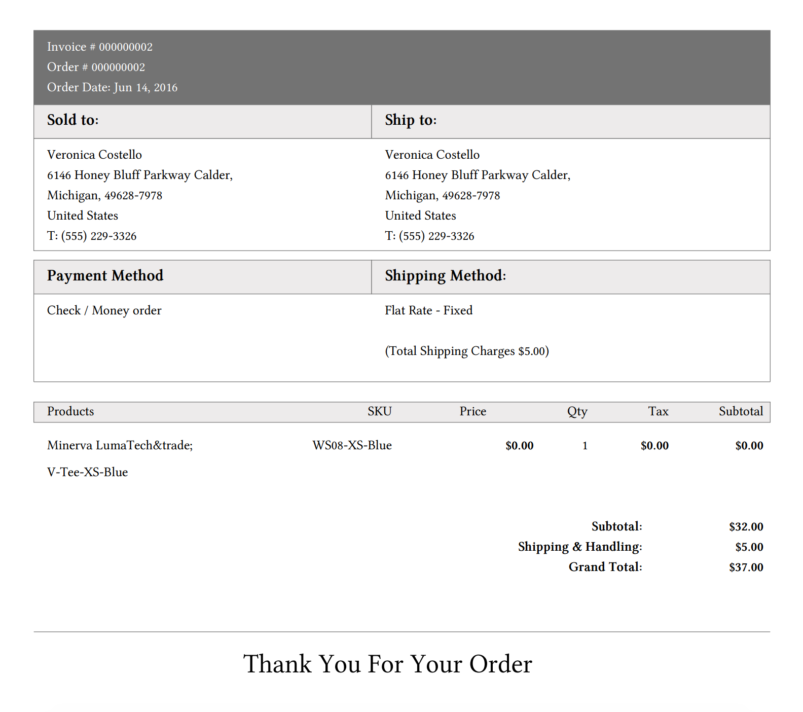

# Magento 2: Custom Text In Bottom Of Invoice PDF

The extension allows the admin edit the text to display in the bottom of the Invoice PDF.

The extension create a new Static Block with name ”Pdf Invoice text” and predefine content “Thank you for buying from us”

The content of the static block will display at the bottom of Invoice PDF:

